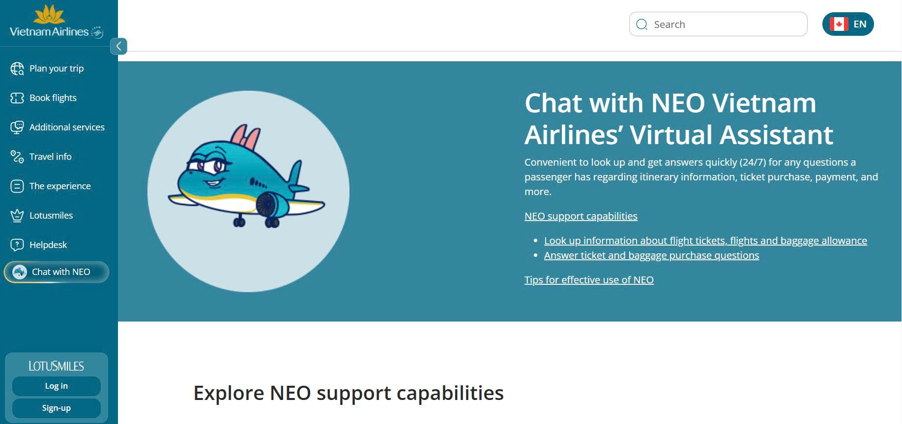
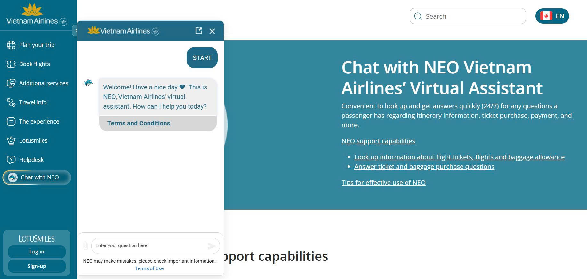
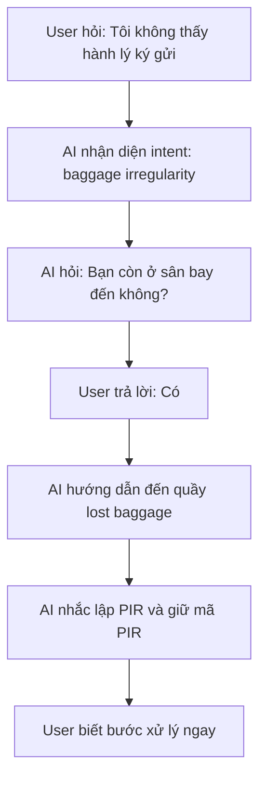
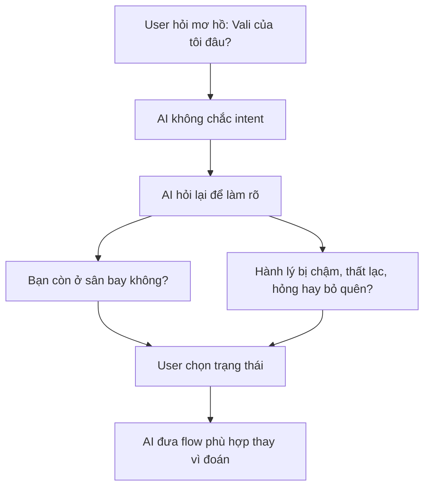
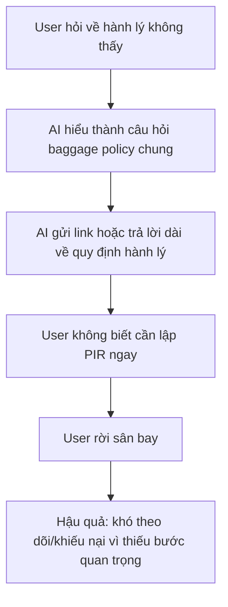
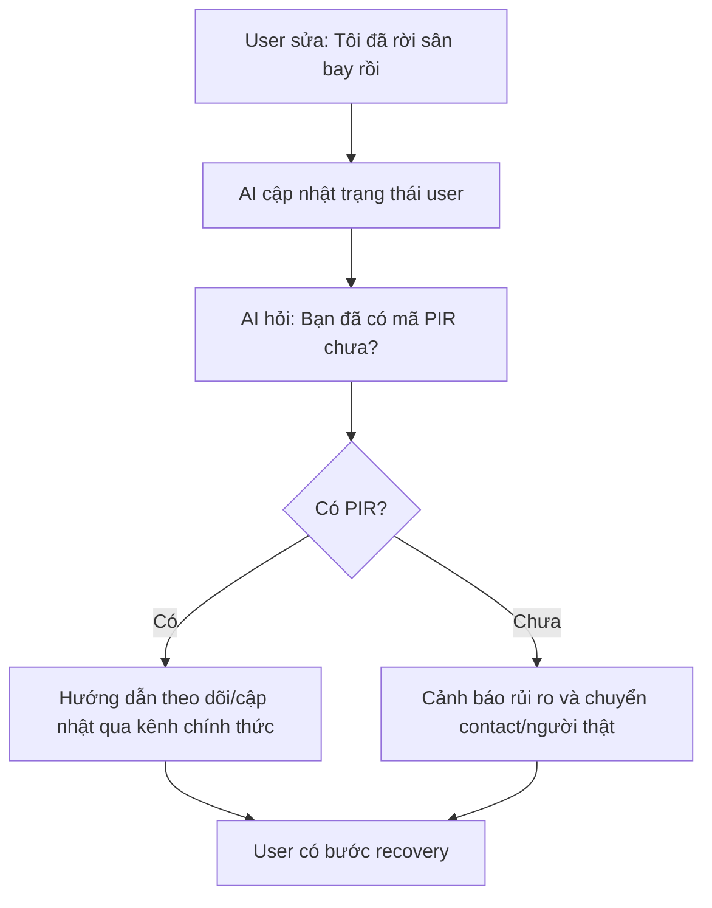
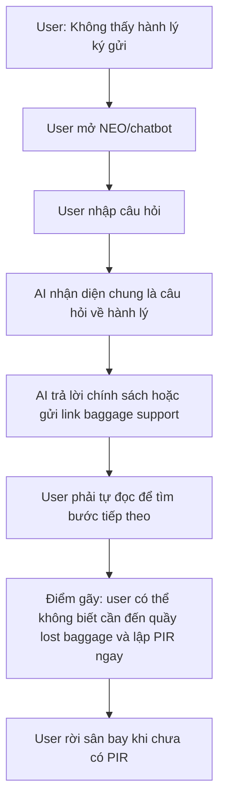
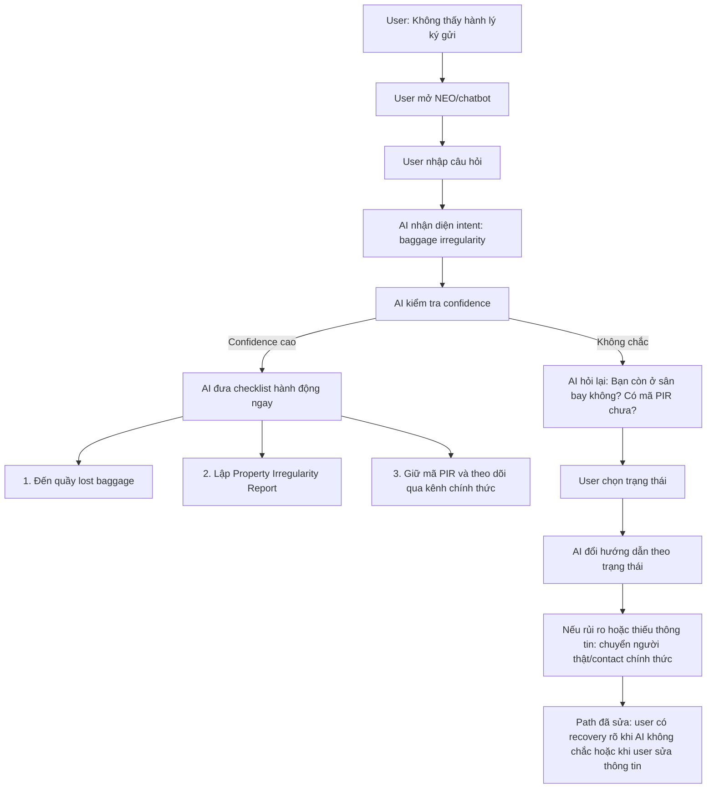

# Workshop - Mổ App AI Thật

**Học viên:** Nguyễn Minh Đức

**Mã học viên:** 2A202600808

**App được chọn:** Vietnam Airlines - NEO  
**Scope dùng thử:** Chatbot hỗ trợ hành lý, cụ thể là tình huống hành khách không thấy hành lý ký gửi sau khi hạ cánh.  

## 1. Chọn một sản phẩm để dùng thử

| Sản phẩm | AI feature | Cách truy cập |
|---|---|---|
| Vietnam Airlines - NEO | Chatbot hỗ trợ vé, hành lý, khiếu nại và thông tin chuyến bay | Website Vietnam Airlines / Zalo Vietnam Airlines |

**Link truy cập / nguồn tham khảo:**

- https://www.vietnamairlines.com/ca/en/support/chatbot
- https://www.vietnamairlines.com/ca/en/support/condition-of-chatbot-NEO
- https://dev.vna.vn/us/en/travel-information/baggage/baggage-supports

Màn hình NEO chatbot Vietnam Airlines:


## 2. Dùng thử: promise vs reality

### Product hứa gì?

NEO hứa hỗ trợ hành khách tra cứu và nhận câu trả lời nhanh về vé, chuyến bay, thanh toán, hành lý và các vấn đề dịch vụ. Với nhóm câu hỏi về hành lý, user có thể kỳ vọng NEO giúp biết cần làm gì khi hành lý bị chậm, thất lạc hoặc có vấn đề.

### User nào được hứa sẽ được giúp?

Hành khách Vietnam Airlines đang chuẩn bị bay, đang trong hành trình, hoặc vừa hạ cánh và cần hỗ trợ nhanh về vé/chuyến bay/hành lý.

User cụ thể trong bài này: hành khách vừa đến sân bay nhưng không thấy hành lý ký gửi, đang lo và cần biết phải làm gì ngay.

### Bạn kỳ vọng AI làm được task nào?

Khi user nhập:

```text
Tôi đến sân bay rồi nhưng không thấy hành lý ký gửi. Tôi phải làm gì?
```

Kỳ vọng AI:

- Nhận ra đây là tình huống hành lý chậm/thất lạc, không phải câu hỏi hành lý chung.
- Hỏi lại user còn ở sân bay không.
- Hướng dẫn user đến quầy hành lý thất lạc tại sân bay đến.
- Nhắc user lập Property Irregularity Report và giữ mã PIR.
- Nếu user đã rời sân bay hoặc case rủi ro, chuyển sang người thật/contact chính thức.

### Khi dùng thật, điểm gãy xuất hiện ở đâu?

Điểm gãy nằm ở khả năng chatbot có thể trả lời chung chung bằng chính sách/link thay vì ưu tiên hành động khẩn cấp. Trong case hành lý thất lạc, nếu user không được nhắc lập PIR ngay tại sân bay, user có thể rời sân bay mà thiếu bằng chứng quan trọng để theo dõi/khiếu nại sau này.

### Evidence

**Screenshot**

Màn hình NEO chatbot Vietnam Airlines với khung trò chuyện:


Màn hình support Vietnam Airlines:


**Quote từ app/web/review**

Quote từ trang NEO: NEO hỗ trợ passenger với các câu hỏi về booking, payment, ticketing, baggage.

Quote từ điều khoản NEO: response của chatbot được tạo tự động và có thể không chính xác hoặc không đầy đủ.

Quote từ trang baggage support: hành khách cần liên hệ quầy hành lý thất lạc tại sân bay đến và nhận Property Irregularity Report.

**Prompt/input đã thử**

```text
Tôi đến sân bay rồi nhưng không thấy hành lý ký gửi. Tôi phải làm gì?
```

```text
Vali của tôi không ra băng chuyền, giờ tôi nên làm gì?
```

```text
Tôi đã rời sân bay rồi mới phát hiện chưa nhận được hành lý ký gửi.
```

**Hành vi quan sát được**

Vietnam Airlines có hướng dẫn riêng cho baggage claim, nhưng thông tin quan trọng như quầy lost baggage, PIR và Worldtracer nằm ở trang chính sách/hỗ trợ riêng. Nếu chatbot không nhận diện đúng intent và kéo bước quan trọng lên đầu, user phải tự đọc nhiều thông tin để tìm hành động cần làm.

## 3. Vẽ 4 paths

### Happy path



### Low-confidence path



### Failure path



### Correction path



## 4. Viết finding thành quyết định

```text
Khi user vừa đến sân bay và hỏi NEO về hành lý ký gửi không xuất hiện,
AI/product có thể hiểu đây là câu hỏi hành lý chung và trả lời bằng chính sách/link thay vì nhận ra đây là tình huống cần hành động ngay,
hậu quả là user có thể rời sân bay mà chưa liên hệ quầy hành lý thất lạc và chưa lập Property Irregularity Report.
Lỗi thuộc layer Intent + Safety + UX Recovery.
Nên sửa bằng low-confidence path và recovery UX: hỏi user còn ở sân bay không, ưu tiên hướng dẫn lập PIR, show nguồn chính thức, và chuyển sang người thật khi case mơ hồ/rủi ro.
```

## 5. Sketch as-is / to-be

### As-is: flow hiện tại, đánh dấu điểm gãy



### To-be: flow đề xuất, đánh dấu path đã sửa



## 6. Tự kiểm trước khi nộp

- [x] Có ít nhất 1 screenshot hoặc observation cụ thể.
- [x] Có đủ 4 paths.
- [x] Finding được viết thành product decision, không chỉ là nhận xét.
- [x] Sketch có as-is và to-be.
- [x] Có một câu nói rõ finding này sẽ đổi gì trong SPEC: SPEC cần chuyển từ "chatbot hỏi đáp hành lý" sang "AI triage sự cố hành lý với low-confidence path, PIR reminder và fallback sang người thật".

